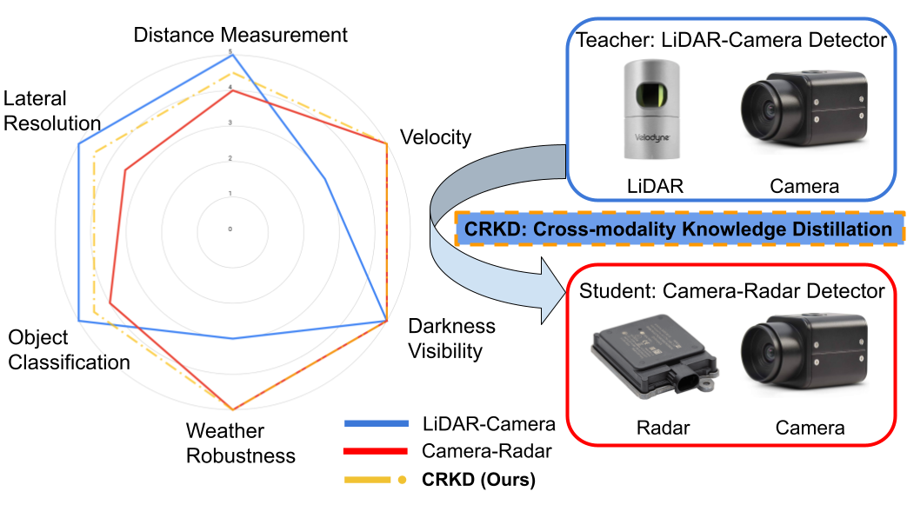

# CRKD: Enhanced Camera-Radar Object Detection wtih Cross-modality Knowledge Distillation


<!-- add figure figures/pitch.png -->
<p align="center">
  

### [Website](https://song-jingyu.github.io/CRKD/) | [Paper](https://arxiv.org/abs/2403.19104)

## News

- **(2024/2/26)** CRKD is accepted to CVPR 2024!

## Abstract

In the field of 3D object detection for autonomous driving, LiDAR-Camera (LC) fusion is the top-performing sensor configuration. Still, LiDAR is relatively high cost, which hinders adoption of this technology for consumer automobiles. Alternatively, camera and radar are commonly deployed on vehicles already on the road today, but performance of Camera-Radar (CR) fusion falls behind LC fusion. In this work, we propose Camera-Radar Knowledge Distillation (CRKD) to bridge the performance gap between LC and CR detectors with a novel cross-modality KD framework. We use the Bird’s-Eye-View (BEV) representation as the shared feature space to enable effective knowledge distillation. To accommodate the unique cross-modality KD path, we propose four distillation losses to help the student learn crucial features from the teacher model. We present extensive evaluations on the nuScenes dataset to demonstrate the effectiveness of the proposed CRKD framework.

## Results

### 3D Object Detection (on nuScenes val)
Can comment baseline lines if we don't need to show them

|   Model   | Modality | Backbone | Resolution  | mAP  | NDS  |
| :-------: | :------: | :------: | :---------: | :--: | :--: |
| [Teacher](https://drive.google.com/file/d/1TwLmSNyG0VUWQ2bwgbTHKGz6HxJnOvX-/view?usp=sharing)  |   L+C    |    R50   |   256x704   | 62.6 | 68.2 |
| [Baseline](https://drive.google.com/file/d/1gKbqKfwNksw55Tn2DxsEjhb2yodKC9qz/view?usp=sharing)  |   C+R    |    R50   |   256x704   | 41.8 | 52.9 |
| [Student](https://drive.google.com/file/d/1zSbSMVBccRaeMVkukB-u3YYhB-OMZnuC/view?usp=sharing)  |   C+R    |    R50   |   256x704   | 41.7 | 53.5 |
| [CRKD](https://drive.google.com/file/d/1BTnzzQq87fJh53_5OBzlKoTuCnXWUdp0/view?usp=sharing)  |   C+R    |    R50   |   256x704   | 43.2 | 54.9 |
| [Teacher](https://drive.google.com/file/d/1bPt6a085RQ5woTF4OIQN0AGRU0_l2jdd/view?usp=sharing)  |   L+C    |    SwinT   |   256x704   | 66.1 | 70.3 |
| [Baseline](https://drive.google.com/file/d/1J64dBFeMTGolhWJ9M0j0jcFgTTHAcnkx/view?usp=sharing)  |   C+R    |    SwinT   |   256x704   | 43.2 | 54.1 |
| [Student](https://drive.google.com/file/d/11nR5DIszI3tqKfURLqDVdMgQezjsn5HV/view?usp=sharing)  |   C+R    |    SwinT   |   256x704   | 44.9 | 55.9 |
| [CRKD](https://drive.google.com/file/d/1qtJOIORNR9DyqR4mhg1WPKjy5a5NRBkL/view?usp=sharing)  |   C+R    |   SwinT  |   256x704   | 46.7 | 57.3 |


### 3D Object Detection (on nuScenes test)

|   Model   | Modality | Backbone | Resolution  | mAP  | NDS  |
| :-------: | :------: | :------: | :---------: | :--: | :--: |
|    [CRKD](https://drive.google.com/file/d/1qtJOIORNR9DyqR4mhg1WPKjy5a5NRBkL/view?usp=sharing)   |   C+R    |   SwinT  |   256x704   | 48.7 | 58.7 |

## Usage

### Prerequisites

The code is built with following libraries:

- Python >= 3.8, \<3.9
- OpenMPI = 4.0.4 and mpi4py = 3.0.3 (Needed for torchpack)
- Pillow = 8.4.0 (see [here](https://github.com/mit-han-lab/bevfusion/issues/63))
- [PyTorch](https://github.com/pytorch/pytorch) >= 1.9, \<= 1.10.2
- [tqdm](https://github.com/tqdm/tqdm)
- [torchpack](https://github.com/mit-han-lab/torchpack)
- [mmcv](https://github.com/open-mmlab/mmcv) = 1.4.0
- [mmdetection](http://github.com/open-mmlab/mmdetection) = 2.20.0
- [nuscenes-dev-kit](https://github.com/nutonomy/nuscenes-devkit)


We also provide a [Dockerfile](docker/Dockerfile) to ease environment setup. To get started with docker, please make sure that `nvidia-docker` is installed on your machine. After that, please execute the following command to build the docker image:

```bash
cd docker
# Build docker image
docker build . -t crkd
# Run docker container
./run.sh
```

We recommend the users to run data preparation (instructions are available in the next section) outside the docker if possible. Note that the dataset directory should be an absolute path. Within the docker, please run the following command to clone our repo and install custom CUDA extensions:

```bash
git clone https://github.com/Song-Jingyu/CRKD.git && cd CRKD
```

```bash
# Before set up the environment, ensure the following command lines exist in the bevfusion/setup.py file.
make_cuda_ext(
                name="feature_decorator_ext",
                module="mmdet3d.ops.feature_decorator",
                sources=["src/feature_decorator.cpp"],
                sources_cuda=["src/feature_decorator_cuda.cu"],
            ),
# And comment these lines in CRKD/mmdet3d/ops/feature_decorator/src/feature_decorator.cpp.
static auto registry =
     torch::RegisterOperators("feature_decorator_ext::feature_decorator_forward", &feature_decorator_forward);
```

```bash
python setup.py develop
```

You can then create a symbolic link `data` to the `/dataset` directory in the docker.
```bash
# Our dataset path
# Please change to your path before use
/mnt/ws-frb/users/lingjunz/nuScenes/data/dataset/
```

### Data Preparation

#### nuScenes

Please follow the instructions from [here](https://github.com/open-mmlab/mmdetection3d/blob/master/docs/en/datasets/nuscenes_det.md) to download and preprocess the nuScenes dataset. Please remember to download both detection dataset and the map extension (for BEV map segmentation). After data preparation, you will be able to see the following directory structure (as is indicated in mmdetection3d):

```
mmdetection3d
├── mmdet3d
├── tools
├── configs
├── data
│   ├── nuscenes
│   │   ├── maps
│   │   ├── samples
│   │   ├── sweeps
│   │   ├── v1.0-test
|   |   ├── v1.0-trainval
│   │   ├── nuscenes_database
│   │   ├── nuscenes_old_infos_train.pkl
│   │   ├── nuscenes_old_infos_val.pkl
│   │   ├── nuscenes_old_infos_test.pkl
│   │   ├── nuscenes_old_coor_dbinfos_train.pkl

```

Note: please change the dataset path to yours in the config files before running any experiment!


### Training
We provide pretrained student and teacher models to reproduce our results on nuScenes. For the training details of the student and teacher models, please refer to [BEVFusion](https://github.com/mit-han-lab/bevfusion).

For LiDAR-camera teacher model, please run:

```bash
# SwinT
torchpack dist-run -np 4 python tools/train.py configs/nuscenes/det/centerhead/lssfpn/camera+lidar/swint_v0p075/gatedfuser.yaml

# R50
torchpack dist-run -np 4 python tools/train.py configs/nuscenes/det/centerhead/lssfpn/camera+lidar/resnet50/gatedfuser.yaml
```

For camera-radar student model, please run:

```bash
# SwinT
torchpack dist-run -np 4 python tools/train.py configs/nuscenes/det/centerhead/lssfpn/camera+radar/swint/default.yaml

# R50
torchpack dist-run -np 4 python tools/train.py configs/nuscenes/det/centerhead/lssfpn/camera+radar/resnet50/default.yaml
```

Once you have the weights of teacher and student modelsready, you can start training CRKD! For CRKD, please run:

```bash
# SwinT
torchpack dist-run -np 4 python tools/train.py configs/nuscenes/distill/feature_response_distill/feat_fused_da_lr_mean_c2c_scale_mask_relation_resp_kd_dynamic_class_loss_80_256.yaml

# R50
torchpack dist-run -np 4 python tools/train.py configs/nuscenes/distill/feature_response_distill/feat_fused_da_lr_mean_c2c_scale_mask_relation_resp_kd_dynamic_class_loss_80_256_resnet.yaml
```


### Evaluation
We also provide pretrained models for evaluation. Please refer to the Results Table to download the checkpoints.

For evaluating LiDAR-camera teacher model, please run:

```bash
# SwinT
torchpack dist-run -np 4 python tools/test.py configs/nuscenes/det/centerhead/lssfpn/camera+lidar/swint_v0p075/gatedfuser.yaml pretrained/teacher_swint.pth --eval bbox

# R50
torchpack dist-run -np 4 python tools/test.py configs/nuscenes/det/centerhead/lssfpn/camera+lidar/resnet50/gatedfuser.yaml pretrained/teacher_r50.pth --eval bbox
```

For evaluating camera-radar student model, please run:

```bash
# SwinT
torchpack dist-run -np 4 python tools/test.py configs/nuscenes/det/centerhead/lssfpn/camera+radar/swint/default.yaml pretrained/student_gated_swint.pth --eval bbox

# R50
torchpack dist-run -np 4 python tools/test.py configs/nuscenes/det/centerhead/lssfpn/camera+radar/resnet50/default.yaml pretrained/student_gated_r50.pth --eval bbox
```

For evaluating our pretrained CRKD model, please run:

```bash
# SwinT
torchpack dist-run -np 4 python tools/test.py configs/nuscenes/distill/feature_response_distill/feat_fused_da_lr_mean_c2c_scale_mask_relation_resp_kd_dynamic_class_loss_80_256.yaml pretrained/distill_swint.pth --eval bbox

# R50
torchpack dist-run -np 4 python tools/test.py configs/nuscenes/distill/feature_response_distill/feat_fused_da_lr_mean_c2c_scale_mask_relation_resp_kd_dynamic_class_loss_80_256_resnet.yaml pretrained/distill_r50.pth --eval bbox
```

Note: please run `tools/test.py` separately after training to get the final evaluation metrics.


## Citation

If CRKD is useful or relevant to your research, please kindly recognize our contributions by citing our paper:

```bibtex
@inproceedings{zhao2024crkd,
  author    = {Zhao, Lingjun and Song, Jingyu and Skinner, Katherine A},
  title     = {CRKD: Enhanced Camera-Radar Object Detection with Cross-modality Knowledge Distillation},
  journal   = {2024 IEEE/CVF Conference on Computer Vision and Pattern Recognition (CVPR)},
  year      = {2024},
}
```
